# 💳 Captura, Armazenamento e Reuso de Cartões (Stripe, Pagarme, Appmax)

Este documento descreve, em detalhes, como o sistema captura cartões em todos os checkouts, onde e como armazena os tokens nativos dos gateways e como reusa esses cartões para cobranças únicas e recorrentes.


## Visão Geral

- **Armazenamento unificado**: Tabela `customer_payment_methods` guarda os tokens nativos:
  - Stripe: `pm_xxx` em `provider_payment_method_id`
  - Pagarme: `card_xxx` em `provider_payment_method_id`
  - Appmax: `tok_xxx` em `provider_payment_method_id`
- **Service central**: `VaultManager` em `src/lib/payments/vault/manager.ts`
  - `saveCard()`, `listCards()`, `charge()`
  - Deduplicação via `fingerprint` (`provider|brand|last4|expMonth|expYear`)
  - Status padronizado: `ACTIVE`/`EXPIRED`
- **Reuso**: Adapters por gateway (Stripe/Pagarme/Appmax) implementam `chargeWithSavedCard()`
- **Recorrência**: Trigger.dev dispara renovações e reusa cartões salvos


## Modelo de Dados (onde é salvo)

- Arquivo: `prisma/schema.prisma`

```prisma
model CustomerPaymentMethod {
  id                      String          @id @default(cuid())
  customerId              String
  customerProviderId      String?
  provider                PaymentProvider
  accountId               String?
  providerPaymentMethodId String?
  brand                   String?
  last4                   String?
  expMonth                Int?
  expYear                 Int?
  fingerprint             String?
  isDefault               Boolean         @default(false)
  status                  String?         @default("ACTIVE")
  createdAt               DateTime        @default(now())
  updatedAt               DateTime        @updatedAt

  @@unique([provider, accountId, providerPaymentMethodId])
  @@index([customerId, provider, accountId])
  @@map("customer_payment_methods")
}
```

- Tabela: `customer_payment_methods`
- Campo do token: `provider_payment_method_id`
- Status: `ACTIVE`/`EXPIRED`


## Fluxos por Gateway

### Stripe – Captura e Salva

- Frontend (Stripe.js) cria `PaymentMethod` (`pm_xxx`)
- Backend salva via `POST /api/payments/cards/save` chamando `VaultManager.saveCard()`
- Arquivos relevantes:
  - Rota: `src/app/api/payments/cards/save/route.ts`
  - Service: `src/lib/payments/vault/manager.ts`

Exemplo (resumo do backend):
```ts
await vault.saveCard({
  customerId,
  provider: 'STRIPE',
  token: 'pm_xxx',
  brand, last4, expMonth, expYear,
  setAsDefault: true,
})
```

#### Stripe – Reuso

- Rota: `POST /api/payments/charge`
- Adapter: `src/lib/payments/vault/gateways/stripe.ts`
  - Anexa PM ao customer (se necessário): `paymentMethods.attach`
  - Cria PaymentIntent off-session: `paymentIntents.create({ off_session: true, confirm: true })`


### Pagarme – Captura e Salva

- Frontend tokeniza → backend cria card permanente `card_xxx` no Pagarme
- Já existem fluxos que salvam em `customer_payment_methods` durante checkout
- Para o fluxo unificado, também pode salvar via `POST /api/payments/cards/save`
- Arquivos relevantes:
  - Checkouts: `src/app/api/checkout/create/route.ts`, `src/app/api/checkout/subscribe/route.ts`
  - Adapter: `src/lib/payments/vault/gateways/pagarme.ts`

#### Pagarme – Reuso

- `PagarmeGateway.chargeWithSavedCard()` cria `order` com `credit_card.card_id = card_xxx`
- Usado em `POST /api/payments/charge`


### Appmax – Captura e Salva

- Checkout Appmax tokeniza via API → `tok_xxx`
- Integração adicionada: quando `saveCard=true`, salva no Vault automaticamente
- Arquivos relevantes:
  - Checkout: `src/app/api/checkout/appmax/create/route.ts`
  - Service: `VaultManager.saveCard()`

Trecho (resumo):
```ts
if (ccToken && body.saveCard && unifiedCustomerId) {
  await vault.saveCard({
    customerId: unifiedCustomerId,
    provider: 'APPMAX',
    token: ccToken,
    brand, last4, expMonth, expYear,
    setAsDefault: true,
  })
}
```

#### Appmax – Reuso

- Adapter: `src/lib/payments/vault/gateways/appmax.ts`
  - Cria ordem e cobra com `payment.CreditCard.token = tok_xxx`
- Recorrência (Trigger.dev):
  - `trigger/renewal-jobs/appmax.ts`: agora busca o token salvo em `customer_payment_methods` (status `ACTIVE`)


## API Unificada (Salvar, Listar, Cobrar)

### Salvar cartão
- Rota: `POST /api/payments/cards/save`
- Entrada (ex.):
```json
{
  "userId": "user_123",
  "slug": "clinic-slug",
  "provider": "STRIPE|PAGARME|APPMAX",
  "token": "pm_xxx|card_xxx|tok_xxx",
  "brand": "visa",
  "last4": "4242",
  "expMonth": 12,
  "expYear": 2025,
  "setAsDefault": true
}
```

### Listar cartões
- Rota (existente): `GET /api/payments/saved-cards?userId=...&slug=...`
- Sugestão: filtrar somente `status = 'ACTIVE'` no SQL caso desejar

### Cobrar com cartão salvo
- Rota: `POST /api/payments/charge`
- Chama `VaultManager.charge()` → Adapter do gateway → cria `payment_transactions`


## Recorrência (Trigger.dev)

- Scheduler diário: `trigger/billing-renewal.ts` (09:00 BRT) seleciona assinaturas due
- Dispara por provedor:
  - `pagarme-prepaid-renewal` (usa `customer_payment_methods` com `card_id`)
  - `appmax-renewal` (agora usa `customer_payment_methods` com `tok_xxx`)
- Idempotência:
  - Pagarme: `tx_pagarme_${order.id}`
  - Appmax: `tx_appmax_${subscriptionId}_${YYYYMM}` (chave determinística + `upsert`)


## Segurança e Compliance

- Somente tokens nativos são armazenados (`pm_xxx`, `card_xxx`, `tok_xxx`).
- Dados sensíveis (número/cvv) **não** são persistidos.
- Expiração: 
  - Verificação em `VaultManager.charge()` → marca `EXPIRED` se vencido.
  - Notificador semanal: `trigger/expiring-cards-notifier.ts` (filtra `status='ACTIVE'` e `isDefault=true`).


## Boas Práticas

- **Status**: use sempre `ACTIVE`/`EXPIRED` (maiúsculo) em filtros e updates.
- **Deduplicação**: evitar cartões duplicados via `fingerprint`.
- **Feature flags**: `TRIGGER_ENABLE_PAGARME_PREPAID`, `TRIGGER_ENABLE_APPMAX` no scheduler diário.
- **Observabilidade**: logs com `subscriptionId`, `provider`, `periodStart/End`, `savedCardId`.


## Arquivos-Chave (referência)

- `src/lib/payments/vault/manager.ts`
- `src/lib/payments/vault/gateways/{stripe,pagarme,appmax}.ts`
- `src/app/api/payments/cards/save/route.ts`
- `src/app/api/payments/charge/route.ts`
- `src/app/api/payments/saved-cards/route.ts`
- `src/app/api/checkout/appmax/create/route.ts`
- `trigger/renewal-jobs/{pagarme-prepaid,appmax}.ts`
- `trigger/billing-renewal.ts`, `trigger/expiring-cards-notifier.ts`


## Fluxo Unificado (Mermaid)

```mermaid
graph TD
  A[Frontend] -->|Tokenização| B[Backend /cards/save]
  B -->|VaultManager.saveCard| C[(customer_payment_methods)]
  D[Frontend] -->|Seleciona cartão| E[Backend /charge]
  E -->|VaultManager.charge| F{Gateway Adapter}
  F -->|Stripe| G[PaymentIntent off_session]
  F -->|Pagarme| H[Order com card_id]
  F -->|Appmax| I[CreditCard com token]
  E --> J[(payment_transactions)]
```




## Testes Rápidos (E2E)

- Stripe:
  1) Tokenizar com Stripe.js → salvar via `/cards/save`
  2) Cobrar via `/charge` e verificar `payment_transactions`
- Pagarme:
  1) Criar `card_xxx` no fluxo atual (checkout) → já salva
  2) Cobrar via `/charge`
- Appmax:
  1) Checkout com `saveCard=true` → salva `tok_xxx`
  2) Renovação via Trigger.dev ou `/charge`
