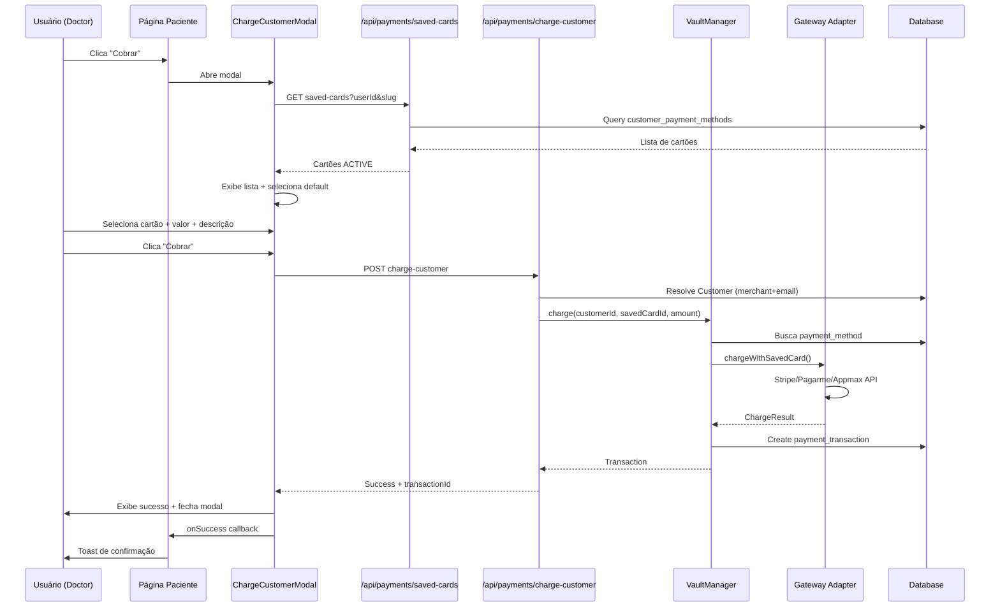

# 💳 Botão de Cobrança - Implementação Completa

## Visão Geral

Implementação de um botão "Cobrar" na página de detalhes do paciente (`/doctor/patients/[id]`) que permite selecionar um cartão salvo e realizar cobranças avulsas usando o sistema de VaultManager.

## Arquivos Criados/Modificados

### 1. Nova Rota Backend
**Arquivo**: `src/app/api/payments/charge-customer/route.ts`

- **Método**: `POST /api/payments/charge-customer`
- **Função**: Cobra um paciente usando cartão salvo, resolvendo internamente o `Customer` unificado
- **Entrada**:
  ```json
  {
    "patientId": "user_123",
    "clinicId": "clinic_456",
    "savedCardId": "cpm_789",
    "amountCents": 9900,
    "description": "Consulta",
    "metadata": {}
  }
  ```
- **Saída**:
  ```json
  {
    "ok": true,
    "data": {
      "transactionId": "pi_xxx",
      "status": "succeeded",
      "statusV2": "SUCCEEDED",
      "amountCents": 9900,
      "currency": "BRL",
      "paidAt": "2025-01-23T15:00:00Z"
    }
  }
  ```

**Lógica**:
1. Valida sessão e acesso à clínica
2. Busca `merchant` da clínica
3. Resolve `patient` (User) por `patientId`
4. Busca ou cria `Customer` unificado (`merchantId` + `email`)
5. Valida que o `savedCardId` pertence ao customer e está `ACTIVE`
6. Chama `VaultManager.charge()` para processar a cobrança
7. Retorna dados da transação criada

### 2. Componente Modal
**Arquivo**: `src/components/payments/ChargeCustomerModal.tsx`

- **Props**:
  - `open`, `onOpenChange`: controle do modal
  - `patientId`: User.id do paciente
  - `patientName`, `patientEmail`: dados do paciente
  - `clinicId`, `clinicSlug`: contexto da clínica
  - `onSuccess`: callback quando cobrança é bem-sucedida

**Funcionalidades**:
1. **Carrega cartões salvos**: `GET /api/payments/saved-cards?userId={patientId}&slug={clinicSlug}`
   - Filtra apenas cartões `ACTIVE`
   - Seleciona automaticamente o cartão padrão (`isDefault`)
2. **Exibe lista de cartões**: RadioGroup com `brand •••• last4 (expMonth/expYear)`
3. **Input de valor**: Campo para digitar valor em R$ (ex: `99,00`)
4. **Input de descrição**: Campo opcional para descrição da cobrança
5. **Botão Cobrar**: Envia requisição para `/api/payments/charge-customer`
6. **Feedback visual**:
   - Loading durante processamento
   - Sucesso: mostra transactionId e fecha modal após 2s
   - Erro: exibe mensagem de erro

### 3. Página de Detalhes do Paciente
**Arquivo**: `src/app/(authenticated)/doctor/patients/[id]/page.tsx`

**Modificações**:
1. **Imports adicionados**:
   ```typescript
   import ChargeCustomerModal from '@/components/payments/ChargeCustomerModal';
   import { useClinic } from '@/contexts/clinic-context';
   import { CreditCard } from 'lucide-react';
   ```

2. **Estado adicionado**:
   ```typescript
   const { currentClinic } = useClinic();
   const [showChargeModal, setShowChargeModal] = useState(false);
   ```

3. **Botão "Cobrar"** (linha ~906):
   ```tsx
   <Button 
     variant="outline" 
     size="sm"
     onClick={() => setShowChargeModal(true)}
   >
     <CreditCard className="h-4 w-4 mr-2" />
     Cobrar
   </Button>
   ```

4. **Modal renderizado** (linha ~1522):
   ```tsx
   <ChargeCustomerModal
     open={showChargeModal}
     onOpenChange={setShowChargeModal}
     patientId={params.id as string}
     patientName={patient?.name}
     patientEmail={patient?.email}
     clinicId={currentClinic?.id || ''}
     clinicSlug={currentClinic?.slug || ''}
     onSuccess={(transactionId) => {
       console.log('Charge successful:', transactionId);
       toast.success(`Cobrança realizada! ID: ${transactionId}`);
     }}
   />
   ```

## Fluxo Completo



## Contexto e Dados Disponíveis

### ClinicContext
- **Hook**: `useClinic()` de `@/contexts/clinic-context`
- **Dados disponíveis**:
  - `currentClinic.id`: ID da clínica atual
  - `currentClinic.slug`: Slug da clínica (usado para buscar cartões)
  - `currentClinic.name`, `currentClinic.owner`, etc.

### Página de Paciente
- **Rota**: `/doctor/patients/[id]`
- **Parâmetro**: `params.id` = `User.id` do paciente
- **Estado `patient`**: contém `name`, `email`, `phone`, etc.

### Resolução de Customer
A rota `/api/payments/charge-customer` resolve o `Customer` unificado internamente:
1. Busca `merchant` da `clinic`
2. Busca `patient` (User) por `patientId`
3. Busca `Customer` por `(merchantId, email)`
4. Se não existir, cria novo `Customer`

Isso garante que o frontend não precisa conhecer o `customerId`, apenas o `patientId` (User.id).

## Segurança e Validação

### Backend (`/api/payments/charge-customer`)
- ✅ Valida sessão com `getServerSession`
- ✅ Verifica acesso à clínica (owner ou membro ativo)
- ✅ Valida schema com Zod
- ✅ Verifica que `savedCardId` pertence ao customer
- ✅ Verifica que cartão está `ACTIVE`
- ✅ Registra `chargedBy` (userId) nos metadados

### Frontend (Modal)
- ✅ Filtra apenas cartões `ACTIVE`
- ✅ Valida valor > 0
- ✅ Desabilita botão durante processamento
- ✅ Exibe feedback visual (loading, sucesso, erro)
- ✅ Fecha modal automaticamente após sucesso

## Testes Manuais

### Cenário 1: Paciente com cartão salvo
1. Acesse `/doctor/patients/[id]` de um paciente que já tem cartão salvo
2. Clique no botão "Cobrar"
3. Modal abre e carrega cartões automaticamente
4. Cartão padrão já vem selecionado
5. Digite valor (ex: `99,00`) e descrição
6. Clique "Cobrar"
7. Aguarde processamento
8. Veja toast de sucesso e modal fecha

### Cenário 2: Paciente sem cartão salvo
1. Acesse `/doctor/patients/[id]` de um paciente sem cartão
2. Clique no botão "Cobrar"
3. Modal abre e exibe mensagem: "Nenhum cartão salvo encontrado"
4. Botão "Cobrar" fica desabilitado

### Cenário 3: Erro de cobrança
1. Teste com cartão que falha (ex: cartão expirado)
2. Modal exibe mensagem de erro
3. Usuário pode tentar novamente ou fechar modal

## Próximos Passos (Opcional)

- [ ] Adicionar histórico de cobranças na página do paciente
- [ ] Permitir estorno de cobranças
- [ ] Adicionar filtros por status na listagem de transações
- [ ] Notificar paciente por email após cobrança
- [ ] Adicionar suporte a múltiplas moedas
- [ ] Permitir parcelamento (se gateway suportar)

## Dependências

- `VaultManager` (`src/lib/payments/vault/manager.ts`)
- Gateway Adapters (`src/lib/payments/vault/gateways/*`)
- `customer_payment_methods` table (Prisma)
- `ClinicContext` (`src/contexts/clinic-context.tsx`)
- shadcn/ui components (Dialog, Button, Input, RadioGroup, etc.)
- lucide-react icons
- react-hot-toast

## Status

✅ **Implementação completa e funcional**
- Rota backend criada e testada
- Modal de cobrança implementado
- Botão adicionado na página de detalhes
- Integração com VaultManager funcionando
- Validações e segurança aplicadas
