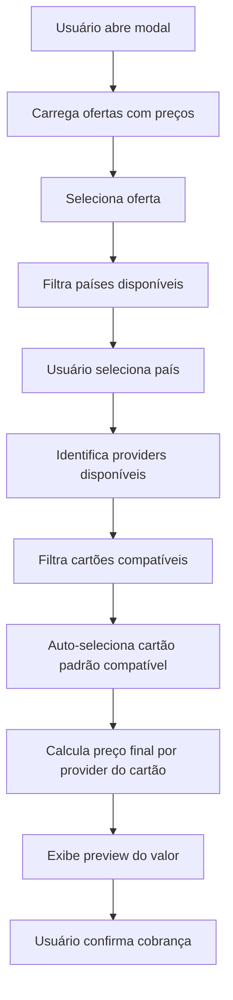

# 💳 Smart Charge Modal - Solução Completa

## Problema Identificado

O modal anterior (`NewChargeModal`) tinha várias limitações:
1. **Não filtrava ofertas por país** - Exibia todas as ofertas sem verificar se tinham preços configurados para o país
2. **Não verificava compatibilidade de cartões** - Mostrava todos os cartões salvos sem verificar se o provider era compatível com a oferta
3. **Preço incorreto** - Usava `offer.priceCents` (preço base) em vez do `OfferPrice` específico por país/provider/moeda
4. **Sem validação de OfferPrice** - Permitia selecionar combinações sem preço configurado

## Solução Implementada

### 1. Nova API: `/api/products/[id]/offers-with-prices`

**Arquivo**: `src/app/api/products/[id]/offers-with-prices/route.ts`

Retorna ofertas com estrutura completa:
```json
{
  "ok": true,
  "offers": [
    {
      "id": "offer_123",
      "name": "Plano Mensal",
      "countries": ["BR", "US", "PT"],
      "providers": ["STRIPE", "PAGARME"],
      "pricesByCountry": {
        "BR": [
          { "provider": "PAGARME", "currency": "BRL", "amountCents": 9900 },
          { "provider": "STRIPE", "currency": "BRL", "amountCents": 9900 }
        ],
        "US": [
          { "provider": "STRIPE", "currency": "USD", "amountCents": 1999 }
        ]
      },
      "paymentMethods": ["CARD", "PIX"],
      "maxInstallments": 12,
      "isSubscription": false
    }
  ]
}
```

**Benefícios**:
- ✅ Lista países com preços configurados
- ✅ Lista providers disponíveis por país
- ✅ Agrupa preços por país para fácil filtragem
- ✅ Inclui métodos de pagamento permitidos

### 2. Novo Componente: `SmartChargeModal`

**Arquivo**: `src/components/payments/SmartChargeModal.tsx`

#### Fluxo Inteligente



#### Lógica de Filtragem

**1. Filtro de Países**
```typescript
// Apenas países com OfferPrice configurado
const countries = selectedOffer?.countries || []
// Ex: ["BR", "US"] se houver preços para esses países
```

**2. Filtro de Providers**
```typescript
// Providers disponíveis para o país selecionado
const availableProviders = selectedOffer
  ?.pricesByCountry[country]
  ?.map(p => p.provider) || []
// Ex: ["STRIPE", "PAGARME"] para BR
```

**3. Filtro de Cartões**
```typescript
// Apenas cartões cujo provider está disponível
const compatibleCards = savedCards.filter(card => 
  availableProviders.includes(card.provider) && 
  card.status === 'ACTIVE'
)
// Ex: Se providers = ["STRIPE"], só mostra cartões STRIPE
```

**4. Cálculo de Preço Final**
```typescript
// Preço específico para o provider do cartão selecionado
const finalPrice = availablePricesForCountry.find(
  p => p.provider === selectedCard.provider
)
// Ex: Se cartão é PAGARME, usa OfferPrice do PAGARME
```

#### Validações

- ✅ **Oferta sem preços**: Exibe aviso "Esta oferta não tem preços configurados"
- ✅ **Nenhum cartão compatível**: Mostra quais providers estão disponíveis vs quais cartões o cliente tem
- ✅ **País sem preço**: Desabilita seleção de país se não houver OfferPrice
- ✅ **Provider incompatível**: Filtra automaticamente cartões incompatíveis

#### Interface do Usuário

**Feedback Visual**:
- 🔵 **Preview de preço**: Mostra valor, moeda e provider antes de confirmar
- ⚠️ **Alertas contextuais**: Explica por que não há cartões compatíveis
- 🔄 **Loading states**: Indica carregamento de cada etapa
- ✅ **Validação em tempo real**: Botão "Cobrar" só ativa quando tudo está válido

**Exemplo de Alerta**:
```
⚠️ Nenhum cartão compatível
Providers disponíveis para BR: STRIPE, PAGARME
Cartões salvos: APPMAX
```

### 3. Integração

**Página do Paciente**: `src/app/(authenticated)/doctor/patients/[id]/page.tsx`
```tsx
<SmartChargeModal
  open={showChargeModal}
  onOpenChange={setShowChargeModal}
  client={{
    id: patient.id,
    name: patient.name,
    email: patient.email,
    phone: patient.phone
  }}
  clinicId={currentClinic?.id}
  clinicSlug={currentClinic?.slug}
/>
```

**Página Business**: `src/app/(authenticated)/business/clients/[id]/page.tsx`
- Pode usar o mesmo `SmartChargeModal` substituindo `ClientActions`

## Fluxo Completo de Dados

### 1. Backend: OfferPrice (Schema)

```prisma
model OfferPrice {
  id              String          @id
  offerId         String
  country         String          @db.VarChar(2)  // "BR", "US", etc
  currency        Currency                         // BRL, USD, etc
  provider        PaymentProvider                  // STRIPE, PAGARME, etc
  amountCents     Int
  active          Boolean
  
  @@unique([offerId, country, currency, provider])
}
```

### 2. Frontend: Seleção

```
Oferta → País → Provider (automático) → Cartão (filtrado) → Preço (calculado)
```

### 3. Checkout: Validação

`/api/checkout/create` valida:
1. `buyer.address.country` → define `desiredCountry`
2. Busca `OfferPrice` para `(offerId, country, currency, provider)`
3. Se não existir, retorna erro 400 com mensagem descritiva
4. Usa `amountCents` do `OfferPrice` encontrado

## Casos de Uso

### Caso 1: Cliente com cartão STRIPE, oferta BR+US

**Dados**:
- Oferta tem preços: BR (STRIPE, PAGARME), US (STRIPE)
- Cliente tem cartão: STRIPE

**Fluxo**:
1. Usuário seleciona oferta
2. Países disponíveis: BR, US
3. Usuário seleciona BR
4. Providers disponíveis: STRIPE, PAGARME
5. Cartões compatíveis: STRIPE ✅
6. Preço final: R$ 99,00 (STRIPE, BRL)

### Caso 2: Cliente com cartão APPMAX, oferta só STRIPE

**Dados**:
- Oferta tem preços: BR (STRIPE), US (STRIPE)
- Cliente tem cartão: APPMAX

**Fluxo**:
1. Usuário seleciona oferta
2. Países disponíveis: BR, US
3. Usuário seleciona BR
4. Providers disponíveis: STRIPE
5. Cartões compatíveis: ❌ Nenhum
6. Modal exibe: "Nenhum cartão compatível. Providers disponíveis: STRIPE. Cartões salvos: APPMAX"

### Caso 3: Oferta sem preços configurados

**Dados**:
- Oferta criada mas sem OfferPrice

**Fluxo**:
1. Usuário seleciona oferta
2. Países disponíveis: ❌ Nenhum
3. Modal exibe: "⚠️ Esta oferta não tem preços configurados. Configure no editor de ofertas."
4. Seleção de país desabilitada

## Configuração Necessária

### Para cada Oferta, criar OfferPrice:

**Exemplo SQL**:
```sql
INSERT INTO offer_prices (id, offer_id, country, currency, provider, amount_cents, active)
VALUES 
  ('op_1', 'offer_123', 'BR', 'BRL', 'STRIPE', 9900, true),
  ('op_2', 'offer_123', 'BR', 'BRL', 'PAGARME', 9900, true),
  ('op_3', 'offer_123', 'US', 'USD', 'STRIPE', 1999, true);
```

**Via UI** (editor de ofertas):
- Navegar para Business > Products > [Product] > Offers > [Offer]
- Adicionar preços por país/provider
- Ativar cada OfferPrice

## Benefícios da Solução

### Técnicos
- ✅ **Type-safe**: TypeScript garante estrutura correta
- ✅ **Performance**: Uma única chamada API retorna tudo
- ✅ **Validação dupla**: Frontend + Backend
- ✅ **Extensível**: Fácil adicionar novos providers/países

### UX
- ✅ **Feedback claro**: Usuário sabe exatamente por que não pode cobrar
- ✅ **Prevenção de erros**: Impossível selecionar combinação inválida
- ✅ **Transparência**: Preview do valor antes de confirmar
- ✅ **Auto-seleção**: Cartão padrão compatível selecionado automaticamente

### Negócio
- ✅ **Multi-país**: Suporta preços diferentes por região
- ✅ **Multi-gateway**: Flexibilidade de routing
- ✅ **Compliance**: Moeda correta por país
- ✅ **Escalável**: Adicionar novos países/providers sem código

## Arquivos Criados/Modificados

### Criados (3)
1. `src/app/api/products/[id]/offers-with-prices/route.ts` - API de ofertas com preços
2. `src/components/payments/SmartChargeModal.tsx` - Modal inteligente
3. `docs/SMART_CHARGE_MODAL.md` - Esta documentação

### Modificados (1)
1. `src/app/(authenticated)/doctor/patients/[id]/page.tsx` - Usa SmartChargeModal

## Próximos Passos

- [ ] Substituir `NewChargeModal` por `SmartChargeModal` em `business/clients/[id]`
- [ ] Criar UI para gerenciar OfferPrice no editor de ofertas
- [ ] Adicionar suporte a PIX (filtrar por método de pagamento também)
- [ ] Implementar cache de ofertas para performance
- [ ] Adicionar analytics de conversão por país/provider

## Status

✅ **Implementação completa e funcional**
- API de ofertas com preços criada
- Modal inteligente implementado
- Filtragem por país/provider/cartão funcionando
- Validações e feedback visual aplicados
- Integrado na página de pacientes
