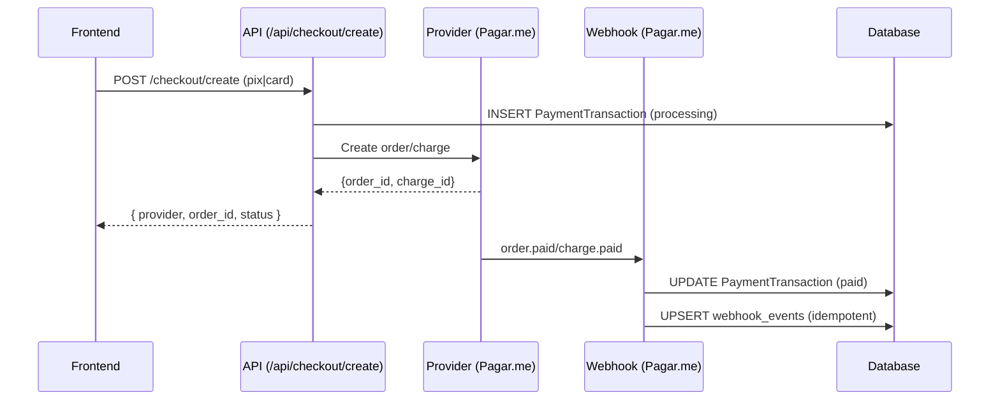
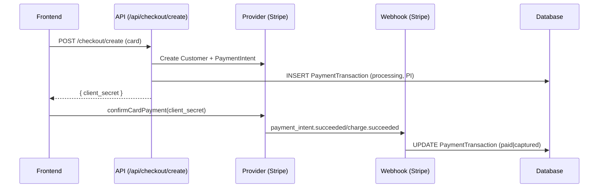
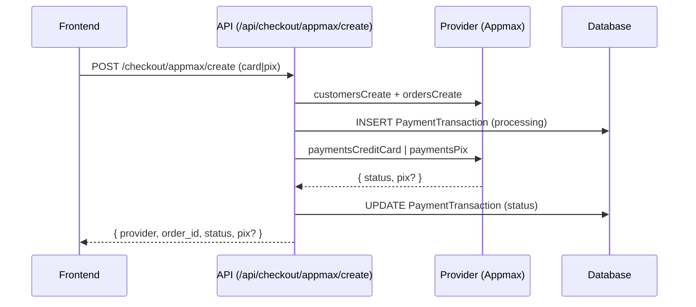

# Checkout Routes Reference

This document describes each checkout-related API route, what it does, which models it writes, and gaps to fill so every flow consistently creates Customer, CustomerProvider, CustomerPaymentMethod, PaymentTransaction, and CustomerSubscription when applicable.

## Summary Table

- **KRXPAY one-time/prepaid**: `src/app/api/checkout/create/route.ts`
  - Writes: PaymentTransaction (processing). Webhook (Pagar.me) finalizes.
  - Does NOT write: Customer, CustomerProvider, CustomerPaymentMethod (currently).
- **KRXPAY subscription (card)**: `src/app/api/checkout/subscribe/route.ts`
  - Writes: Customer (best-effort), CustomerSubscription. PaymentTransaction via webhook on first charge.
  - Does NOT write: CustomerProvider, CustomerPaymentMethod.
- **Stripe PI (one-time)**: branch inside `src/app/api/checkout/create/route.ts`
  - Writes: PaymentTransaction (PI placeholder). Webhooks complete.
  - Does NOT write: Customer, CustomerProvider, CustomerPaymentMethod (currently).
- **Stripe subscription**: `src/app/api/checkout/stripe/subscribe/route.ts` (plus webhooks)
  - Writes via webhooks: CustomerSubscription and PaymentTransaction of invoices.
  - Does NOT write: Customer, CustomerProvider, CustomerPaymentMethod (currently).
- **Appmax one-time (card/pix)**: `src/app/api/checkout/appmax/create/route.ts`
  - Writes: PaymentTransaction (placeholder + status), creates customer on provider.
  - Does NOT write: Customer, CustomerProvider, CustomerPaymentMethod; no webhook yet.

---

## KRXPAY one-time / prepaid

- **Route**: `src/app/api/checkout/create/route.ts`
- **Input (high-level)**:
  - `productId`, optional `slug`, `buyer { name,email,phone,document,address }`, `payment { method: 'pix'|'card'|'boleto', card?, pix?, installments? }`, optional `offerId`, optional `subscriptionPeriodMonths` (prepaid sub em create), optional `amountCents` fallback.
- **Behavior**:
  - Resolve `product/clinic/merchant` + offer/price; aplica split (feature flag) e monta payload KRXPAY v5.
  - Card: tenta criar `customer` e `card` no provedor (wallet) e usa `card_id` se sucesso; senão, raw card.
  - PIX: cria QR e retorna dados.
- **Writes**:
  - `payment_transactions`: INSERT com `provider='pagarme'`, `routedProvider='KRXPAY'`, `status='processing'`.
  - Webhook Pagar.me (`src/app/api/payments/pagarme/webhook/route.ts`): atualiza status, define split snapshot e reconcilia por `orderId/chargeId`.
- **Gaps**:
  - Não persiste `Customer`, `CustomerProvider`, `CustomerPaymentMethod` locais.
  - `paidAt/capturedAt/refundedAt` e `status_v2` não preenchidos.
- **To fill**:
  - Após `pagarmeCreateCustomer`/`pagarmeCreateCustomerCard`, criar vault local e vincular na `PaymentTransaction`.

---

## KRXPAY subscription (card)

- **Route**: `src/app/api/checkout/subscribe/route.ts`
- **Input (high-level)**:
  - `productId`, optional `slug`, `buyer { name,email,phone,document,address }`, `payment { method: 'card', saved_card_id?, provider_customer_id?, card{...} }`.
- **Behavior**:
  - Garante plano (ou planless), cria `customer` e `card` no provedor, cria `subscription` v5 (com split quando habilitado).
- **Writes**:
  - `customers`: upsert best-effort (por email), com `merchantId` e `metadata` básica.
  - `customer_subscriptions`: INSERT/UPDATE por `provider_subscription_id`, status e períodos.
  - `payment_transactions`: via webhook na primeira cobrança (charge/order)
- **Gaps**:
  - Não cria `customer_providers` (providerCustomerId) e `customer_payment_methods` (card_id) locais.
- **To fill**:
  - Após `pagarmeCreateCustomer` e `pagarmeCreateCustomerCard`, criar `CustomerProvider` e `CustomerPaymentMethod`; setar `customerProviderId` em `customer_subscriptions` e referenciar nas próximas `payment_transactions`.

---

## Stripe PI (one-time)

- **Route**: branch em `src/app/api/checkout/create/route.ts`
- **Input (high-level)**:
  - `productId`, `buyer`, `payment { method: 'card' }` → roteia para Stripe (quando regras determinam Provider=STRIPE).
- **Behavior**:
  - Cria `Stripe Customer` e `PaymentIntent`, retorna `client_secret` para confirmação no front.
- **Writes**:
  - `payment_transactions`: INSERT leve para PI (`provider='stripe'`), webhooks completam estados e charge.
- **Gaps**:
  - Não cria `Customer`, `CustomerProvider` locais; não cria `CustomerPaymentMethod` após charge.
- **To fill**:
  - Criar `Customer` + `CustomerProvider` após criar Stripe Customer; em `charge.succeeded`, criar `CustomerPaymentMethod` (pm_xxx, brand/last4/exp) e vincular transações.

---

## Stripe subscription

- **Route**: `src/app/api/checkout/stripe/subscribe/route.ts` + `src/app/api/stripe/webhook/route.ts`
- **Input (high-level)**:
  - Dependente do front (Elements); cria a assinatura na Stripe.
- **Behavior**:
  - Webhook mantém `customer_subscriptions` atualizada (status/períodos) e grava `payment_transactions` das invoices.
- **Writes**:
  - `customer_subscriptions`: UPDATE por `provider_subscription_id` (snake_case) com períodos e status.
  - `payment_transactions`: upsert para invoices (period start/end, `customerSubscriptionId`).
- **Gaps**:
  - Não cria `customers`, `customer_providers`, `customer_payment_methods` locais.
- **To fill**:
  - Upsert de `Customer`/`CustomerProvider` no momento da criação da assinatura; `CustomerPaymentMethod` quando PM anexado/charge concluída.

---

## Appmax one-time (card/pix)

- **Route**: `src/app/api/checkout/appmax/create/route.ts`
- **Input (high-level)**:
  - `productId|slug`, `buyer { name,email,document_number,... }`, `method: 'card'|'pix'`, `card?`, `installments?`, `items?`.
- **Behavior**:
  - Cria `customer` e `order` na Appmax, persiste `payment_transactions` (placeholder), depois paga via card/pix e atualiza status. Mapeia `paid|authorized|pending|processing`.
- **Writes**:
  - `payment_transactions`: INSERT early (processing), UPDATE status.
- **Gaps**:
  - Sem `customers`, `customer_providers`, `customer_payment_methods` locais; sem webhook (refund/chargeback/recorrência).
- **To fill**:
  - Após `customersCreate`/tokenização/pagamento, criar `Customer`/`CustomerProvider`/`CustomerPaymentMethod`; implementar webhook Appmax e normalizar auditoria e `status_v2`.

---

## Webhooks

- **KRXPAY**: `src/app/api/payments/pagarme/webhook/route.ts`
  - Atualiza/upserta `payment_transactions`, aplica split em cobrança de assinatura, envia emails, reconcilia order/charge.
  - Melhorias: setar `paidAt/capturedAt/refundedAt`, `status_v2`, vincular `customerId` quando possível.

- **Stripe**: `src/app/api/stripe/webhook/route.ts`
  - Mantém `customer_subscriptions`; atualiza `payment_transactions` (PI/charge/invoice) com períodos e vínculos.
  - Melhorias: persistir `Customer/Provider/PaymentMethod` locais em pontos determinísticos.

- **Appmax**: (não implementado)
  - Recomendado: criar rota para status/refund/chargeback + idempotência.

---

## Inputs/Outputs (normalized)

- **One‑time response** (todas as rotas):
  - `{ provider, order_id, status, card_status?, pix? }`
- **Subscription response** (KRXPAY/Stripe):
  - `{ provider, subscription_id, status }`
- **Status endpoint**: `src/app/api/checkout/status/route.ts`
  - `{ success, provider, normalized: { status, amount_minor?, currency?, order_id?, charge_id? } }`

---

## Roadmap de padronização

- **Vault interno**: criar sempre `Customer`, `CustomerProvider`, `CustomerPaymentMethod` quando aplicável; vincular em `PaymentTransaction`.
- **Enums canônicos**: passar a escrever `provider_v2/status_v2` e auditoria.
- **Webhooks completos**: adicionar Appmax e completar KRXPAY audit.
- **Adapter**: gradualmente envolver rotas atuais num contrato de adapter (sem quebrar flows).

---

## Sequence Diagrams

### KRXPAY one-time (create)



### KRXPAY subscription (subscribe)

```mermaid
sequenceDiagram
    participant F as Frontend
    participant A as API (/api/checkout/subscribe)
    participant P as Provider (Pagar.me)
    participant W as Webhook
    participant D as Database

    F->>A: POST /checkout/subscribe (card)
    A->>P: create customer + card + subscription
    A->>D: UPSERT Customer; INSERT/UPDATE CustomerSubscription
    A-->>F: { provider, subscription_id, status }

    P->>W: charge.created (first invoice)
    W->>D: UPDATE/UPSERT PaymentTransaction (paid)
```

### Stripe PI (one-time)



### Appmax (one-time)



---

## Error Scenarios

- **KRXPAY create – Provider timeout**
  - When: Provider API > 30s
  - Current: 500; tx fica "processing"
  - Fix:
    - Retry 3x (exponential backoff)
    - Criar PaymentAttempt (novo) para auditar tentativas
    - Reconciliar via job diário e/ou webhook backfill

- **Stripe PI – Card declined**
  - Current: charge.failed → webhook atualiza status
  - Fix:
    - Mapear `last_payment_error` → mensagens claras
    - Sugerir método alternativo (PIX/outro cartão)

- **Appmax – Sem webhook**
  - When: Refund processado no provedor
  - Current: status fica `paid`
  - Fix:
    - Implementar webhook handler
    - Job de reconciliação diário
    - Alerta se divergência > 1%

---

## Retry Strategy

- **Idempotency Keys (frontend → backend)**
  - Header: `Idempotency-Key: checkout_${userId}_${timestamp}_${random}`
  - Backend: checar/armazenar resultado por 24h; retornar cache se existir

- **Provider Retries**
  - Network error/timeouts: 3x exponential (1s, 2s, 4s)
  - 5xx: 2x linear (5s, 10s)
  - 4xx: no retry
  - Timeout final: marcar para reconciliação

---

## Concurrency Scenarios

- **Double click (mesmo usuário)**
  - Solução: idempotency key + unique index (`idempotency_key`) + 409 em duplicatas

- **Webhook chega antes da API**
  - Solução: UPSERT em webhook; API só atualiza se status atual < status do webhook (anti-downgrade)

- **Webhooks duplicados**
  - Solução: `webhook_events(provider, provider_event_id)` unique; processar uma vez, responder 200 aos demais

---

## Security Checklist

- **Input Validation**: amount > 0, email válido, CPF/CNPJ válido, cartão não expirado, CVV 3-4 dígitos
- **Rate Limiting**: 3 tentativas/10min por user; 10/IP/hora; backoff progressivo
- **PCI**: nunca logar/storar dados de cartão (apenas token); HTTPS; TLS 1.2+
- **Webhooks**: verificar assinatura (HMAC), timestamp < 5min, opcional whitelist de IP, rate limit por provider

---

## Performance Targets

| Operation | Target (p95) | Alert |
|-----------|--------------|-------|
| KRXPAY create (PIX) | < 2s | > 3s |
| KRXPAY create (card) | < 3s | > 5s |
| Stripe PI create | < 1s | > 2s |
| Appmax create | < 4s | > 6s |
| Webhook processing | < 500ms | > 1s |

- **Bottlenecks**: tokenização cartão (~800ms), escrita DB (~50ms), email (~200ms)
- **Optimizations**: cache configs merchant (TTL 5min), emails async, batch writes quando viável, pooling HTTP

---

## Monitoring & Alerts

- **Metrics**
  - Success rate por provider/method
  - Duração por rota/provider
  - Error rate por código
  - Lag de webhooks

- **Alerts**
  - Success < 95% (5min) → oncall
  - Error > 5% (5min) → Slack
  - p95 > 5s (10min) → Slack
  - Webhook lag > 5min → Slack
  - Reconciliação diária: faltam > 10 tx → Email

---

## Testing Strategy

- **Unit**: validação de input, montagem de payloads, seleção de provider
- **Integration (sandbox)**: KRXPAY PIX happy-path, decline de cartão, reconciliação
- **E2E**: create → pay/decline → webhook → success page
- **Load**: alvo 1000 RPS, pico 5000 RPS (p95 < 5s)

---

## Rollback Procedures

- **Falha ao subir nova rota**
  - Sintomas: error > 10%, success < 80%, p95 > 10s
  - Ações: inspecionar logs; `git revert` e redeploy; opcional: roteamento para fallback provider

- **Migration falhou**
  - `npx prisma migrate status` / `resolve --rolled-back`
  - Corrigir e redeploy

- **Webhook quebrado**
  - Desabilitar temporariamente, corrigir, reabilitar e reprocessar (replay)

---

## Data Retention Policy

| Data | Retention | Rationale |
|------|-----------|-----------|
| PaymentTransaction | 7 anos | Legal/tributário |
| CustomerPaymentMethod | 3 anos inativo | PCI DSS |
| Webhook raw payload | 90 dias | Debug |
| Idempotency keys | 24h | Duplicates |
| Logs (app) | 30 dias | Troubleshooting |
| Logs (audit) | 7 anos | Compliance |

- **Archival**: job mensal para mover dados antigos (S3) e limpar primário; GDPR: anonimizar PII mantendo dados financeiros

