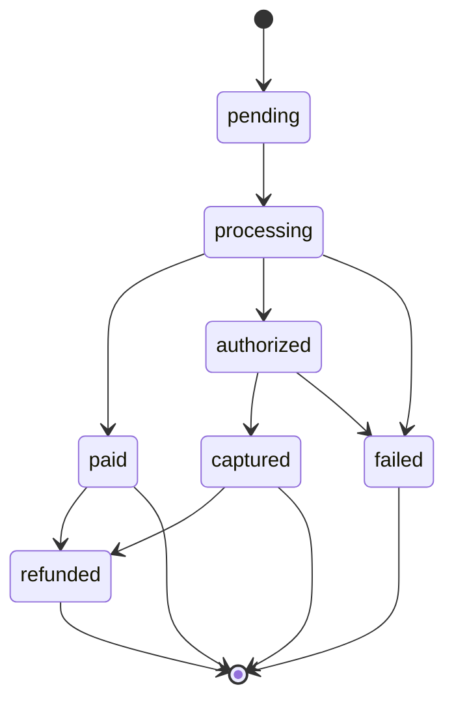

# Payments Architecture & Flows

This document describes how checkout flows are implemented for products and subscriptions across the three current gateways: KRXPAY (Pagar.me v5), Stripe, and Appmax. It covers frontend pages, API endpoints, provider libraries, environment flags, persistence, split rules, webhooks, status normalization, success page behavior, known gaps, and best practices.

## Overview

- **Frontend (Checkout UI)**
  - File: `src/app/[slug]/checkout/[id]/page.tsx`
  - Decides provider and endpoint based on offer, payment method, and provider selection (KRXPAY/Stripe/Appmax), then posts to the appropriate API route.
  - Handles card data entry or PIX choice, sends payloads accordingly, and redirects to success.

- **Success Page**
  - File: `src/app/[slug]/checkout/success/page.tsx`
  - Derives method and final state from provider order/payment/tx status (prefers provider status over normalized DB) and shows approved vs processing.
  - File: `src/app/[slug]/checkout/success/StatusClient.tsx` polls `/api/checkout/status` and stops on terminal states.

- **Primary API Endpoints**
  - KRXPAY (Pagar.me):
    - One‑time/prepaid: `src/app/api/checkout/create/route.ts`
    - Subscription (card): `src/app/api/checkout/subscribe/route.ts`
    - Provider status helper: `src/lib/payments/pagarme/sdk.ts`
  - Stripe:
    - PaymentIntent: `src/app/api/checkout/stripe/intent/route.ts`
    - Subscription: `src/app/api/checkout/stripe/subscribe/route.ts`
    - Integration helpers: `src/lib/payments/stripe/integration.ts`, `src/lib/payments/stripe-client.ts`
  - Appmax:
    - One‑time (card/pix): `src/app/api/checkout/appmax/create/route.ts`
    - Provider SDK: `src/lib/payments/appmax/sdk.ts`

- **Status Normalization**
  - File: `src/app/api/checkout/status/route.ts`
  - Returns `{ success, provider, normalized: { status, amount_minor?, currency?, order_id?, charge_id? } }` combining DB and live provider lookups (Stripe/KRXPAY) and DB for Appmax.

- **Webhooks**
  - KRXPAY (Pagar.me): `src/app/api/payments/pagarme/webhook/route.ts`
  - Stripe webhook routes are separate in Stripe integration (not in this doc’s scope, but PI/Subscribe routes exist).
  - Workers: `workers/webhook-processor.ts` for generic processing.

---

## Environment Flags and Meanings

- `SUBSCRIBE_V1_DELEGATE`: When true, `checkout/subscribe` delegates to legacy KRXPAY subscription implementation in `src/lib/providers/pagarme/legacy.ts`.
- `PAGARME_ENABLE_SPLIT`: Enables percentage split rules in KRXPAY.
- `PAGARME_RECIPIENT_ID_OVERRIDE`: Clinic recipient override for KRXPAY split.
- `PAGARME_PLATFORM_RECIPIENT_ID_OVERRIDE`: Platform recipient override for KRXPAY split.
- `PAGARME_SPLIT_FALLBACK_ON_RECIPIENT_ERROR`: Drop split on recipient error to let payment through.
- `SUBSCRIBE_DISABLE_DB_PERSIST`: In dev, disables strict persistence to avoid schema mismatches.

---

## Frontend: Checkout Page (`src/app/[slug]/checkout/[id]/page.tsx`)

- **Provider decision**
  - Detects provider per method:
    - Appmax: if selected for card or pix (`isAppmaxFlow`) → endpoint `/api/checkout/appmax/create`.
    - KRXPAY subscriptions:
      - PIX: posts to `/api/checkout/create` with `subscriptionPeriodMonths: 1` (prepaid monthly).
      - Card: if `subMonths > 1`, uses `/api/checkout/create` with `subscriptionPeriodMonths = subMonths` (prepaid multi-month);
        else uses `/api/checkout/subscribe` (recorrente).
    - KRXPAY one‑time: `/api/checkout/create`.
    - Stripe: uses `/api/checkout/stripe/intent` or `/api/checkout/stripe/subscribe` depending on plan vs one‑time.

- **Request payloads (resumo)**
  - Includes `productId`, `offerId`, amount/price info, `buyer` details, and payment method payload:
    - Card KRXPAY: tokenization or raw card; for prepaid subscriptions sets `subscriptionPeriodMonths`.
    - PIX KRXPAY: `subscriptionPeriodMonths` for monthly subscription when using one‑time create.
    - Appmax: card with `{number, cvv, month, year}` or PIX with `buyer.document_number`.
    - Stripe: follows Stripe Elements/PI/subscribe flows.

- **Handling responses**
  - Expects standard fields:
    - One‑time: `{ provider, order_id, status, card_status? | pix? }`
    - Subscription: `{ provider, subscription_id, status }`
  - Redirects to success using `order_id` or `subscription_id` accordingly.

- **Public lookups used by the checkout site**
  - Product public API: `src/app/api/products/public/[id]/route.ts`
    - Used to render product name/image/description/price in checkout and success pages.
  - Clinic public lookup by slug: the success page fetches `/api/clinic/by-slug/:slug` to render branding (logo/colors).
    - Verify route presence. Current repo exposes `src/app/api/clinic/route.ts` (auth-required) but not `by-slug` in this tree.
    - If missing, either add `by-slug` public endpoint or update the success page to use an existing public clinic endpoint.

---

## KRXPAY (Pagar.me) Flows

- **One‑time / Prepaid**
  - API: `src/app/api/checkout/create/route.ts`
  - Uses `src/lib/payments/pagarme/sdk.ts` to create charges/orders, applies split rules (percentage) with clinic/platform recipients.
  - Sends email confirmation and emits events on success.
  - Persists `payment_transactions` (best-effort) with doctor/profile/order.

- **Subscription (card)**
  - API: `src/app/api/checkout/subscribe/route.ts`
  - Delegates to `src/lib/providers/pagarme/legacy.ts` (v5) when `SUBSCRIBE_V1_DELEGATE=true`.
  - Handles split consistent with one‑time, returns `subscription_id` and normalized status.
  - DB persistence best-effort for `customer_subscriptions` and `payment_transactions`.

- **Status**
  - API: `src/app/api/checkout/status/route.ts`
  - For `or_...` (orders) and charges: queries Pagar.me via SDK; for `sub_...`: DB row else fallback to `pagarmeGetSubscription`.

- **Webhooks**
  - API: `src/app/api/payments/pagarme/webhook/route.ts`
  - Updates DB and triggers downstream processing.

- **Split Rules (KRXPAY)**
  - Implemented via percentage split with options per recipient:
    - Clinic: `charge_processing_fee: true`, `charge_remainder_fee: true`, `liable: true`.
    - Platform: usually `charge_processing_fee: false`, `charge_remainder_fee: false`, `liable: true`.
  - Recipient IDs read from env overrides.

---

## Shared/Supporting Payment APIs

- **Pricing (APR, fees) used by checkout and success**
  - `src/app/api/payments/pricing/route.ts` → returns pricing constants like `INSTALLMENT_CUSTOMER_APR_MONTHLY` used to recompute installments.

- **Tokenization & Saved Cards**
  - `src/app/api/payments/tokenize/route.ts` → tokenize card (provider-dependent behind the route).
  - `src/app/api/payments/saved-cards/route.ts` → list or manage saved cards for the customer.

- **Provider Plans Discovery**
  - `src/app/api/payments/provider/plans/route.ts` → list provider plans (for subscription/plan selection UIs).

- **Pagar.me Utility Endpoints**
  - `src/app/api/payments/pagarme/order/[id]/route.ts` → fetch an order by id.
  - `src/app/api/payments/pagarme/status/route.ts` → provider status helper.
  - `src/app/api/payments/pagarme/recipient{/set}/route.ts` → verify/set recipients for split.
  - `src/app/api/payments/pagarme/refresh/route.ts` → refresh data from provider.
  - `src/app/api/payments/pagarme/config{/status}/route.ts` → configuration/status checks.

- **Checkout Session Utilities**
  - `src/app/api/checkout/session/upsert/route.ts` → create/update checkout session metadata.
  - `src/app/api/checkout/session/heartbeat/route.ts` → keep-alive during checkout.
  - `src/app/api/checkout/session/mark/route.ts` → mark steps/milestones of the checkout.

- **Admin Integrations**
  - Appmax: `src/app/api/admin/integrations/appmax/{upsert,verify}/route.ts`
  - Stripe: `src/app/api/admin/integrations/stripe/{upsert,verify}/route.ts`
  - Useful to provision credentials per merchant and validate connectivity.

---

## Stripe Flows

- **One‑time with PaymentIntent**
  - API: `src/app/api/checkout/stripe/intent/route.ts`
  - Uses `src/lib/payments/stripe/integration.ts`.
  - Frontend confirms PI with Stripe Elements, then redirects to success.

- **Subscription**
  - API: `src/app/api/checkout/stripe/subscribe/route.ts`
  - Creates subscription (setup/intents) and returns result; frontend handles confirmation as needed.

- **Status**
  - `checkout/status` resolves Stripe PI/subscription state (either via DB or live API) and returns normalized shape.

---

## Appmax Flows

- **One‑time (card/pix)**
  - API: `src/app/api/checkout/appmax/create/route.ts`
  - Uses `buildAppmaxClientForMerchant()` to instantiate `AppmaxClient` from `merchantIntegration`.
  - Steps:
    1) `customersCreate` with buyer data.
    2) `ordersCreate` with products/shipping/discount.
    3) Persist initial `payment_transactions` row (best‑effort).
    4) `paymentsCreditCard` or `paymentsPix`, map status to `paid|authorized|pending|processing`.
  - Returns `{ ok: true, provider: 'APPMAX', order_id, status, pix? }`.

- **Status**
  - API: `src/app/api/checkout/status/route.ts`
  - Appmax branch looks up `payment_transactions` by `provider='appmax'` and provider IDs; currently no live API fetch fallback.

- **Notes**
  - PIX requires `buyer.document_number`.
  - Tokenization is attempted for card; falls back to raw card data if tokenization fails.

---

## Success Page Logic

- **File**: `src/app/[slug]/checkout/success/page.tsx`
  - Prefers provider statuses (`tx.status || ch.status || order.status`) over normalized DB to avoid stale values.
  - Approved if `paid | captured | authorized | succeeded`; for `sub_...`: `active | trial | trialing`.
  - Renders `StatusClient` only when not approved (spinner hidden when approved).

- **Polling Client**: `src/app/[slug]/checkout/success/StatusClient.tsx`
  - Polls `/api/checkout/status`.
  - Terminal: `paid | authorized | captured | succeeded` ⇒ stop polling and hide spinner.

- **Site checkout behavior (details)**
  - Branding: success page renders clinic logo/colors fetched via clinic lookup (see note on `by-slug`).
  - Product display: uses product public API to show hero image, title, and optional description/subtitle.
  - Translations: locale derived from `accept-language` → pt-BR, es-ES, en-US minimal strings for headers and messages.
  - Currency display: uses `Intl.NumberFormat` with derived currency (`BRL` default) and locale. `formatMoney()` handles unknown currencies.
  - Amounts: distinguishes offer value from paid amount; for installments, recomputes per-installment via pricing APR when needed.
  - Spinner: only shows while non-terminal status; hidden on approved states and not rendered on SSR if approved.

---

## Persistence

- **Tables**
  - `payment_transactions`: best‑effort inserts/updates from `create`, Appmax create route, and subscription flows.
  - `customer_subscriptions`: best‑effort in KRXPAY subscription (`legacy.ts`).
- **Dev Setting**
  - `SUBSCRIBE_DISABLE_DB_PERSIST=true` recommended in dev to avoid schema constraint errors until aligned.

---

## Known Gaps / Anti‑patterns

- **Two KRXPAY code paths**
  - `src/lib/providers/pagarme/legacy.ts` (used) vs `src/lib/providers/pagarme/adapter.ts` (present; not used by routes yet).
  - Recommendation: converge into a single Pagar.me adapter and route through a provider factory.

- **Appmax status**
  - `checkout/status` reads only from DB for Appmax; no live API fallback. Add a fallback if required for reliability.

- **Frontend provider branches**
  - The checkout page branches per provider/endpoint. This is acceptable now but should be simplified by a unified adapter contract when ready.

- **DB schema alignment**
  - Persistence is best‑effort; some columns may not match current schema (e.g., NOT NULL). Keep dev flag or migrate schema.

- **Clinic public endpoint mismatch**
  - The success page fetches `/api/clinic/by-slug/:slug`. If this route isn’t present, add it or adjust the page to a public clinic endpoint to avoid 404s in public flows.

---

## Best Practices & Next Steps

- **Unify Providers via Adapter Contract**
  - Define a strict contract in `src/lib/providers/types.ts` (or `src/lib/payments/core/adapter.ts`) for:
    - `createOrder`, `subscribe`, `status`, `webhook`, optional `tokenize`, `createIntent`.
  - Implement adapters:
    - `pagarme` (wrap current one‑time and `legacy` subscribe), `stripe` (PI/subscribe), `appmax`.
  - Route API endpoints through a provider factory: `src/lib/providers/factory.ts`.

- **Normalize responses**
  - Ensure all endpoints return the same shape so the front never needs provider‑specific conditionals beyond routing.

- **Strengthen status**
  - Add live fallback for Appmax status as needed.

- **Document env and error codes**
  - Add docs for env flags and common error codes per provider in `docs/`.

---

## File Map (Key Paths)

- Frontend:
  - `src/app/[slug]/checkout/[id]/page.tsx`
  - `src/app/[slug]/checkout/success/page.tsx`
  - `src/app/[slug]/checkout/success/StatusClient.tsx`

- API:
  - KRXPAY: `src/app/api/checkout/create/route.ts`, `src/app/api/checkout/subscribe/route.ts`
  - Stripe: `src/app/api/checkout/stripe/intent/route.ts`, `src/app/api/checkout/stripe/subscribe/route.ts`
  - Appmax: `src/app/api/checkout/appmax/create/route.ts`
  - Status: `src/app/api/checkout/status/route.ts`
  - Webhooks: `src/app/api/payments/pagarme/webhook/route.ts`

- Providers / SDKs:
  - KRXPAY: `src/lib/payments/pagarme/sdk.ts`, `src/lib/providers/pagarme/legacy.ts`, `src/lib/providers/pagarme/adapter.ts`
  - Stripe: `src/lib/payments/stripe/integration.ts`, `src/lib/payments/stripe-client.ts`
  - Appmax: `src/lib/payments/appmax/sdk.ts`

- Infra:
  - `workers/webhook-processor.ts`

---

## Mermaid: High‑level Checkout Flow

```mermaid
flowchart LR
  A[Checkout Page] -->|card/pix + provider| B{Provider}
  B -->|KRXPAY one-time| C[/api/checkout/create]
  B -->|KRXPAY subscribe| D[/api/checkout/subscribe]
  B -->|Stripe PI| E[/api/checkout/stripe/intent]
  B -->|Stripe Subscribe| F[/api/checkout/stripe/subscribe]
  B -->|Appmax card/pix| G[/api/checkout/appmax/create]

  C --> H[Success Page]
  D --> H
  E --> H
  F --> H
  G --> H
  H --> I[/api/checkout/status]
  I -->|normalized status| H
```

---

## Troubleshooting

- **Appmax retorna 404**
  - **Causa**: Merchant integration não configurada/ativa.
  - **Solução**:
    - Verifique integrações: `SELECT * FROM merchant_integrations WHERE provider = 'APPMAX';`
    - Configure via: `src/app/api/admin/integrations/appmax/{upsert,verify}/route.ts`.

- **KRXPAY split: Recipient not found / 404**
  - **Causa**: Recipient ID inválido ou ausente.
  - **Solução**:
    - Checar env: `PAGARME_RECIPIENT_ID_OVERRIDE`, `PAGARME_PLATFORM_RECIPIENT_ID_OVERRIDE`.
    - Listar recipients no provedor e usar IDs válidos.
    - Se necessário, habilitar `PAGARME_SPLIT_FALLBACK_ON_RECIPIENT_ERROR=true` (deixa sem split para não bloquear pagamento).

- **Stripe PI falha silenciosamente**
  - **Causa**: Webhook secret incorreto ou falta de configuração.
  - **Solução**: Verificar `STRIPE_WEBHOOK_SECRET` e as URLs de webhook no dashboard.

- **Payment não aparece no DB**
  - **Causa**: Flag de dev `SUBSCRIBE_DISABLE_DB_PERSIST=true` ativa, ou schema divergente.
  - **Solução**: Desabilitar flag em ambientes que exigem persistência; alinhar schema e colunas conforme inserts.

- **Página de sucesso fica em processing**
  - **Causa**: Status normalizado no DB atrasado ou método não incluído como terminal.
  - **Solução**: Já priorizamos status do provedor; terminais: `paid|captured|authorized|succeeded` e, para `sub_`: `active|trial|trialing`.

---

## Quick Start

1) **Configurar ENV**
```bash
cp .env.example .env
# Preencher (exemplos):
# PAGARME_API_KEY=...
# PAGARME_RECIPIENT_ID_OVERRIDE=...
# PAGARME_PLATFORM_RECIPIENT_ID_OVERRIDE=...
# STRIPE_API_KEY=...
# STRIPE_WEBHOOK_SECRET=...
```

2) **Testar fluxos**
```bash
# KRXPAY (PIX) via one-time
curl -X POST http://localhost:3000/api/checkout/create \
  -H 'Content-Type: application/json' \
  -d '{"method":"pix","productId":"prod_x","buyer":{"name":"João","email":"joao@example.com","document":"12345678900"}}'

# Stripe (card) – usar frontend com Stripe Elements

# Appmax (card)
curl -X POST http://localhost:3000/api/checkout/appmax/create \
  -H 'Content-Type: application/json' \
  -d '{"method":"card","productId":"prod_x","buyer":{"name":"João","email":"joao@example.com","document_number":"12345678900"},"card":{"number":"4111111111111111","cvv":"123","month":"12","year":"2025"}}'
```

3) **Verificar status**
```bash
curl "http://localhost:3000/api/checkout/status?id=or_XXXX"
```

---

## API Payloads (Examples)

### KRXPAY One-time PIX
```json
{
  "productId": "prod_xxx",
  "offerId": "offer_xxx",
  "buyer": {
    "name": "João Silva",
    "email": "joao@example.com",
    "document": "12345678900"
  },
  "payment": { "method": "pix" }
}
```

### KRXPAY Subscription (prepaid via create)
```json
{
  "productId": "prod_xxx",
  "offerId": "offer_xxx",
  "subscriptionPeriodMonths": 12,
  "buyer": { "name": "João", "email": "joao@example.com" },
  "payment": { "method": "card", "token": "tok_xxx" }
}
```

### Appmax Card
```json
{
  "productId": "prod_xxx",
  "buyer": {
    "name": "João",
    "email": "joao@example.com",
    "document_number": "12345678900"
  },
  "card": {
    "number": "4111111111111111",
    "cvv": "123",
    "month": "12",
    "year": "2025"
  },
  "method": "card"
}
```

---

## Status Flow



---

## Pre-deployment Checklist

- **Environment**
  - [ ] All ENV vars configured (provider keys, webhook secrets, recipients)
  - [ ] Webhook secrets set (Stripe, Pagar.me)
  - [ ] Recipient IDs valid (KRXPAY split)
  - [ ] DB schema aligned/persistence flags ajustados

- **Testing**
  - [ ] KRXPAY PIX
  - [ ] KRXPAY card
  - [ ] KRXPAY subscription (card)
  - [ ] Stripe PI (card)
  - [ ] Stripe subscription
  - [ ] Appmax card
  - [ ] Appmax PIX

- **Monitoring**
  - [ ] Sentry/observabilidade configurados
  - [ ] Logs estruturados por `{provider, operation}`
  - [ ] Alertas e dashboards

- **Rollback Plan**
  - [ ] Versão anterior tagueada
  - [ ] Procedimento de rollback documentado
  - [ ] Feature flags prontas
